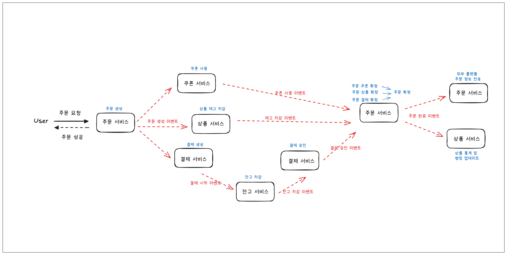
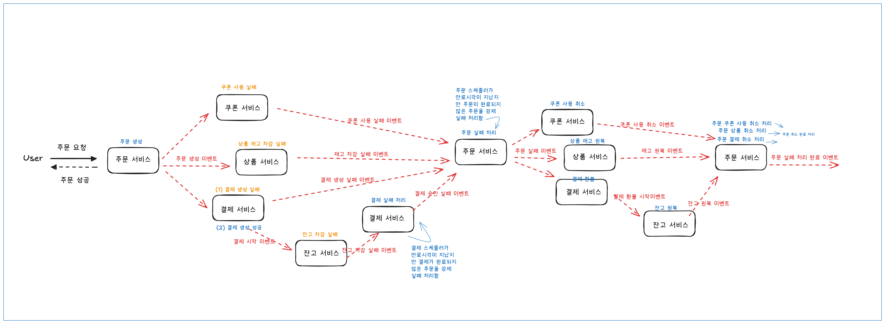

## 1. 개요

현재 시스템은 모놀리식 구조로 되어 있어, 서비스 규모가 확장될 경우 개발 생산성, 확장성, 안정성 측면에서 한계가 있습니다. 이를 개선하기 위해 각 도메인을 독립적인 마이크로서비스로 분리하고자, 문서를 작성했습니다.

---

## 2. 도메인 분리 설계

아래 기준으로 도메인을 분리하고자 했습니다.

- 개별 서비스로 배포되어도 다른 도메인에 영향을 주지 않는가?
- 비즈니스 의미상 명확히 구분되는가?
- 도메인 내 응집도는 높고, 도메인 간 결합도는 낮은가?

| 도메인 |  | 책임 | 주요 기능 |
| --- | --- | --- | --- |
| 사용자 | User | 사용자 인증 | 로그인, 회원가입, 사용자 정보 조회 |
| 잔고 | Balance | 잔고 사용 및 충전 | 잔고 조회, 사용, 충전 |
| 주문 | Order | 주문 생성 및 상태 관리 | 주문 생성, 조회, 취소 |
| 상품 | Product, Stock, ProductSaleRanking, ProductSaleStat | 상품, 상품 재고, 상품 랭킹, 상품 통계 | 상품 등록, 상품 재고 관리, 상품 랭킹 관리, 상품 통계 저장 |
| 결제 | Payment | 결제 승인 및 결과 처리 | 결제 요청, 승인, 실패 처리 |
| 쿠폰 소스 | CouponSource | 쿠폰 소스(정책, 쿠폰 발급) 관리 | 선착순 쿠폰 발급, 쿠폰 소스 생성 및 수정 |
| 쿠폰 | Coupon | 사용자의 쿠폰 관리 | 사용자의 쿠폰 발급, 사용, 조회 |

### 관련 결정사항

- `상품`, `재고`, `상품랭킹`, `상품 통계` 는 각 도메인의 기능이 단순하고, 연관성이 높아 하나의 도메인으로 묶었습니다. 향후 기능 확장 시 별도 서비스로 분리 가능합니다
    - 상품이 단순한 구조로 되어 있어 (상품 등록 로직은 없지만, 단순히 등록한다고 가정) 함께 묶었습니다.
    - 상품 조회시, 상품, 재고, 랭킹이 함께 조회되기 때문에 함께 묶었습니다.
    - 통계는 현재는 상품에 대한 통계 밖에 진행되지 않아 상품과 함께 묶었습니다.
    - 다른 도메인에 대한 통계 서비스가 필요해지거나, 랭킹이 인기 상품 1개가 아닌 여러 개가 관리 되어야 할 경우 서비스를 분리할 수 있을 것 같습니다.
- `쿠폰소스` 와 `쿠폰` 을 목적과 생명 주기가 다르기 때문에 분리하였습니다.
    - 쿠폰 소스 : 쿠폰 발급 정책
    - 쿠폰 : 사용자가 실제 사용하는 쿠폰
    - 쿠폰이 발급되면, 쿠폰 소스와는 무관하게 사용되고 관리되므로 분리했습니다.

---

## 3.  주문에 대한 처리 흐름

주문에 대한 처리 흐름을 다음과 같이 예상했습니다.

- 서비스간 이벤트를 기반으로 통신합니다.
    - 이벤트는 비동기로 발행되며, 하나의 이벤트가 여러 리스너에게 전달되는 1:N 구조를 따릅니다.
- 사용자 인증은 모든 서비스의 앞단에서 인증 서버에서 인증을 진행하고, 해당 정보를 헤더에 담아 전달한다고 가정했습니다.

### 3.1 주문 성공에 따른 처리 흐름

- 주문 생성 후 유저에게 주문 성공 응답을 반환합니다
- 주문 성공 이벤트를 수신하면 각 서비스에서 처리 로직을 진행합니다
- 주문 서비스는 쿠폰 사용, 재고 차감, 결제 승인 이벤트를 수신하면 각 상태를 확정시킵니다 (쿠폰 사용 확정, 재고 차감 확정, 결제 확정)
    - 확정 후 주문이 최종 확정 된 상태가 되면 주문을 확정 상태로 변경하고 주문 완료 이벤트를 발행합니다
- 주문 완료 이벤트를 각 서비스에서 수신하여 처리 로직을 진행합니다

---

## 4. **트랜잭션 처리 한계 및 대응**

- 기존에는 주문이 하나의 트랜잭션으로 관리되어 중간 실패시 롤백이 가능했습니다.
- 서비스가 분리되며 단일 트랜잭션을 유지할 수 없게 되었고, [Choreography 기반 Saga 패턴](https://microservices.io/patterns/data/saga.html#example-choreography-based-saga)을 도입해 보완하고자 했습니다.
    - 각 서비스는 자신의 로컬 트랜잭션을 처리하고, 이벤트를 발행
    - 다른 서비스는 이벤트를 구독하고, 해당 로직을 수행
    - 실패 시 보상 트랜잭션을 이벤트로 처리하여 데이터 정합성 유지
- 결과적 일관성을 보장하는 방식입니다.

### 4.1 주문 실패에 따른 처리 흐름

- 주문 생성 이벤트 후처리 과정에서 실패가 발생하면 실패 이벤트를 발행합니다.
    - (1) 결제 생성 자체가 실패하는 경우 (2) 결제는 생성했지만 잔고 차감에서 실패하는 경우 모두 최종 결제 승인 실패 이벤트가 발행되도록 합니다.
- 주문 서비스는 각 서비스의 실패 이벤트를 수신하면 주문을 실패로 처리하고, 주문 실패 이벤트를 발행합니다.
    - 이벤트 수신 누락 등으로 만료시각이 지났음에도 완료 처리 되지 않은 주문에 대해 `스케줄러가` 주기적으로 확인하여 주문 실패 처리를 진행하고 이벤트를 발행합니다.
- 각 서비스는 주문 실패 이벤트를 수신해 각 취소 로직을 실행하고 이벤트를 발행합니다.
- 주문서비스는 쿠폰, 상품, 결제가 모두 취소 처리가 되면 주문 실패 처리 완료를 진행하고, 주문 실패 처리 완료 이벤트를 발행합니다.
- 주문 실패 처리 완료 이벤트를 수신해 유저에게 주문 실패를 알릴 수 있습니다.

---

## 5. 한계 및 보완

### 5.1 **시스템 복잡도 증가**

- 하나의 요청이 여러 이벤트로 분기되므로 흐름 추적이 어려움
- 각 서비스마다 예외 처리, 재시도, 보상 로직이 필요

### 5.2 **이벤트 처리 관련 이슈**

- 이벤트 누락
    - 비즈니스 로직은 처리 되었지만, 이벤트 발행이 누락되는 경우가 있을 수 있습니다.
    - 이 경우 후속 처리가 진행되지 않아 장애로 이어질 수 있습니다.
    - Transactional Outbox 패턴을 적용하여 이벤트 저장과 로직을 하나의 트랜잭션으로 묶고, 발행은 분리하는 방식으로 보완할 수 있습니다.
- 이벤트 중복 발행
    - 이벤트 관리 방식에 따라 이벤트가 중복 발행 될 수 있습니다.
        - 이벤트 저장하고 따로 발행하는 경우에는 이미 발행한 이벤트를 중복 발행할 수 있습니다.
    - 이벤트 처리 로직이 멱등성을 보장해야 합니다.
- 이벤트 순서 보장
    - 이벤트 순서가 중요한 로직에서 이벤트 발행 순서와는 다른 순서로 이벤트를 수신할 수 있습니다.
        - 예를 들어, 쿠폰 발급 이벤트 보다 쿠폰 사용 이벤트가 먼저 도착할 경우 처리가 어려워집니다.
    - kafka 등의 이벤트 브로커를 활용해 순서 보장을 지원하거나, 이벤트 지연 큐/재시도 큐를 적용해 보완할 수 있습니다.

## 6. 결론

- MSA 분리로 확장성이 높아졌고 서비스별 독립 배포가 가능해졌습니다. 
- 단일 트랜잭션의 보장을 포기하고 Choreography 기반의 Saga 패턴을 도입함으로써, 결과적 일관성(Eventual Consistency)을 확보하려고 했습니다.
- 그러나, 시스템의 복잡도가 증가했고, 이벤트 처리 관련 이슈가 발생할 수 있습니다.
- 현재 운영 상태를 분석하고 분리 단위를 신중하게 고민해야 할 것 같습니다. 

