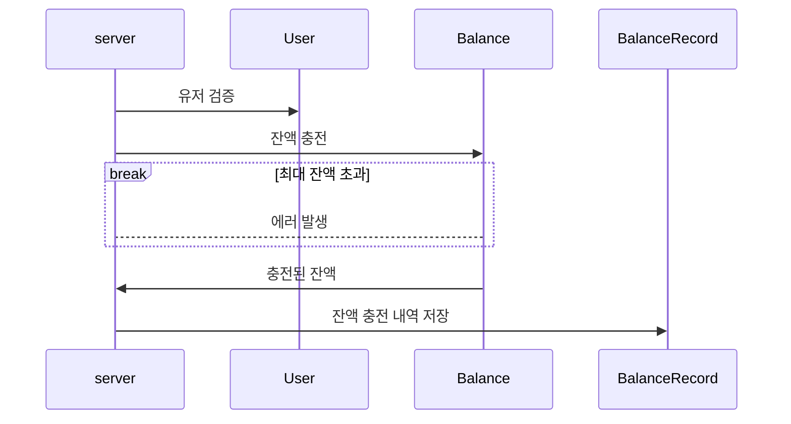
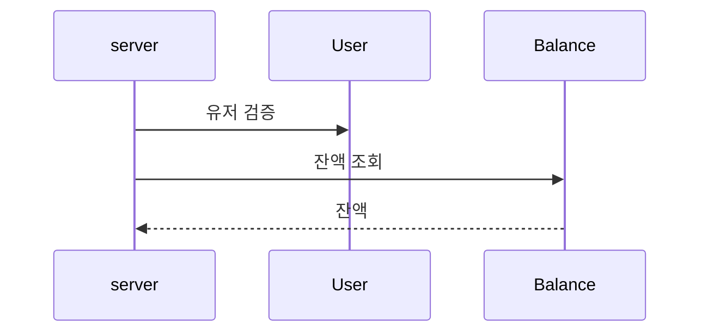
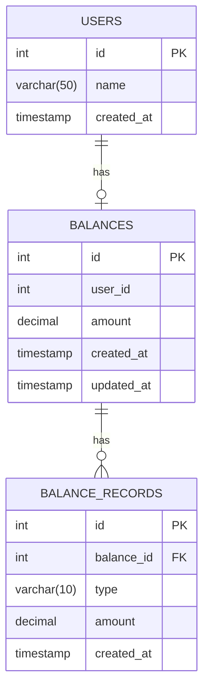

# 잔액 조회/충전

잔액을 조회하고 충전할 수 있는 기능입니다.

## 1. 시퀀스 다이어그램

### 1.1 잔액 충전

- 유저 검증
  - 잔고 충전시, 해당 유저 아이디가 실제 있는 유저인지 검증합니다.
- 잔고가 생성되지 않은 유저
  - 충전 요청시 잔고가 없는 경우, 충전 요청 금액으로 초기화 하여 생성합니다.
- 잔고 금액 제한 
  - 최대 금액을 초과해 저장할 수 없습니다.
  - 최소 금액은 0원입니다.
- 내역 저장
  - 잔고 거래 내역을 저장합니다.
  
### 1.2 잔액 조회

- 해당 유저 아이디가 실제 있는 유저인지 검증합니다.
- 잔액 조회시, 해당 유저의 잔고가 생성되지 않은 경우, API 응답으로 잔고를 0으로 반환합니다.
    - 잔고를 실제 충전하기 시작할 때부터 의미가 있으므로, 따로 생성하지 않고 0으로 반환하도록 했습니다.

## 2. ERD

- 유저는 하나의 잔고를 가질 수 있습니다.
- 유저 이름에 대한 조건은 없지만, name 필드를 추가두었으며, 수정 기능은 제공하지 않습니다.
