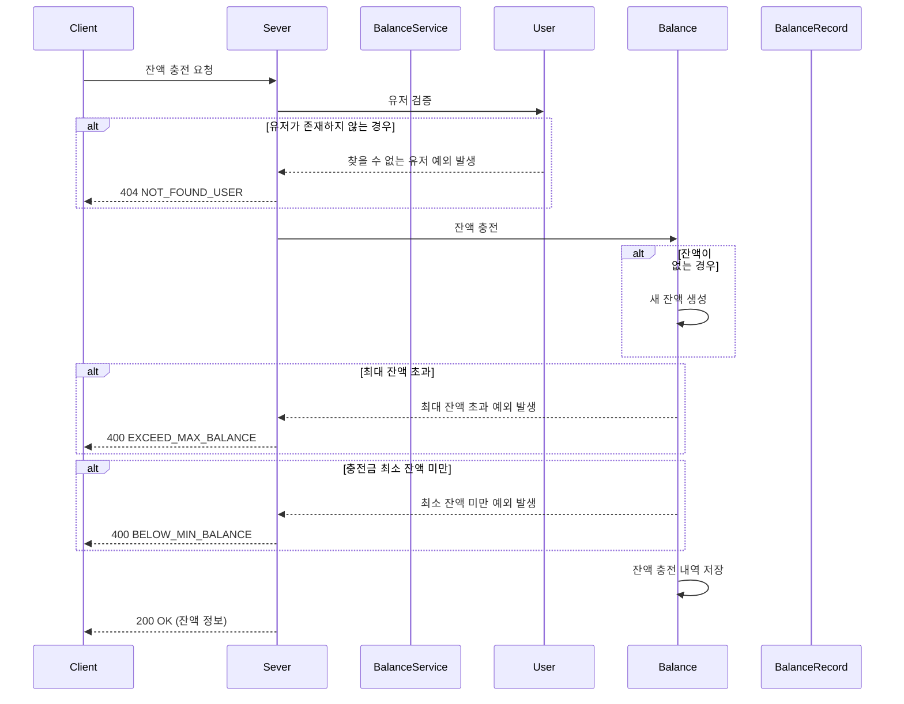
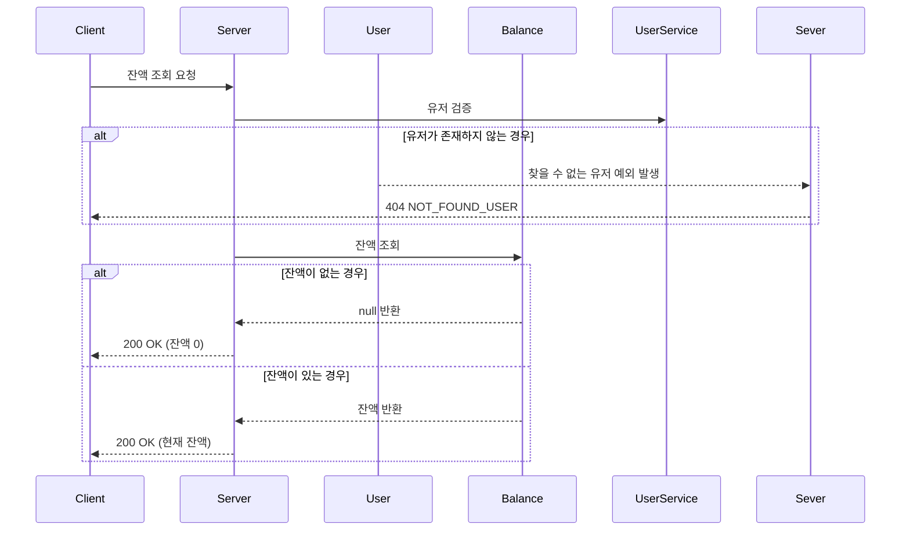
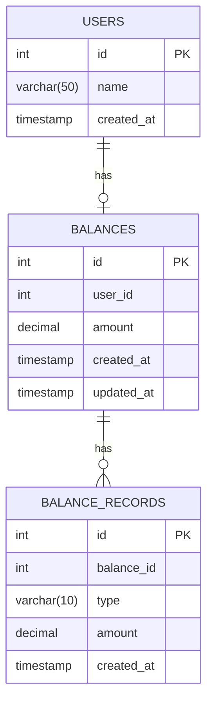

# 잔액 조회/충전

사용자는 자신의 잔액을 조회하고, 필요한 경우 잔액을 충전할 수 있습니다.

## 1. 기능 설명

### 1.1 잔액 충전
사용자가 자신의 계정에 금액을 충전하는 기능입니다.

#### 시퀀스 다이어그램

#### 주요 처리 로직
- **유저 검증**
    - 잔고 충전 시, 해당 유저 아이디가 실제 있는 유저인지 검증합니다.
    - 존재하지 않는 유저인 경우 404 에러를 반환합니다.
- **잔고 생성**
    - 충전 요청 시 잔고가 없는 경우, 충전 요청 금액으로 초기화하여 새로운 잔고를 생성합니다.
- **잔고 금액 제한**
    - 최대 금액(1,000,000원)을 초과해 저장할 수 없습니다.
    - 충전할 수 있는 최소 금액은 0원입니다.
    - 금액 제한을 위반하는 경우 400 에러를 반환합니다.
- **내역 저장**
    - 잔고 거래 내역을 저장합니다.
      - 거래 유형과 금액을 함께 저장합니다.

### 1.2 잔액 조회
사용자가 자신의 현재 잔액을 조회하는 기능입니다.

#### 시퀀스 다이어그램

#### 주요 처리 로직
- **유저 검증**
    - 해당 유저 아이디가 실제 있는 유저인지 검증합니다.
    - 존재하지 않는 유저인 경우 404 에러를 반환합니다.
- **잔액 조회**
    - 해당 유저의 잔고가 생성되지 않은 경우, 응답으로 잔고를 0으로 반환합니다.
      - 잔고를 실제 충전하기 시작할 때부터 의미가 있으므로, 따로 생성하지 않고 0으로 반환합니다.

## 2. 데이터 모델 (ERD)

### 엔티티 설명
- **USERS**: 사용자 정보를 저장하는 테이블
    - `id`: 사용자 고유 식별자
    - `name`: 사용자 이름
    - `created_at`: 사용자 생성 시각
- **BALANCES**: 사용자의 잔액 정보를 저장하는 테이블
    - `id`: 잔액 고유 식별자
    - `user_id`: 사용자 ID (외래 키)
    - `amount`: 현재 잔액
    - `created_at`: 잔액 생성 시각
    - `updated_at`: 잔액 수정 시각
- **BALANCE_RECORDS**: 잔액 변동 내역을 저장하는 테이블
    - `id`: 내역 고유 식별자
    - `balance_id`: 잔액 ID (외래 키)
    - `type`: 거래 유형 (CHARGE, USE, CANCEL_USE)
    - `amount`: 거래 금액
    - `created_at`: 내역 생성 시각

### 관계 설명
- 유저는 하나의 잔고를 가질 수 있습니다. (1:0..1 관계)
- 잔고는 여러 개의 거래 내역을 가질 수 있습니다. (1:N 관계)

## 3. 구현 세부 사항

### 3.1 잔액 제한
- 최소 잔액: 0원
- 최대 잔액: 1,000,000원
- 이 제한은 `BalanceAmount` 클래스에서 검증됩니다.

### 3.2 거래 유형
- `CHARGE`: 잔액 충전
- `USE`: 잔액 사용 (주문 결제 등)
- `CANCEL_USE`: 잔액 사용 취소 (주문 취소 등)
