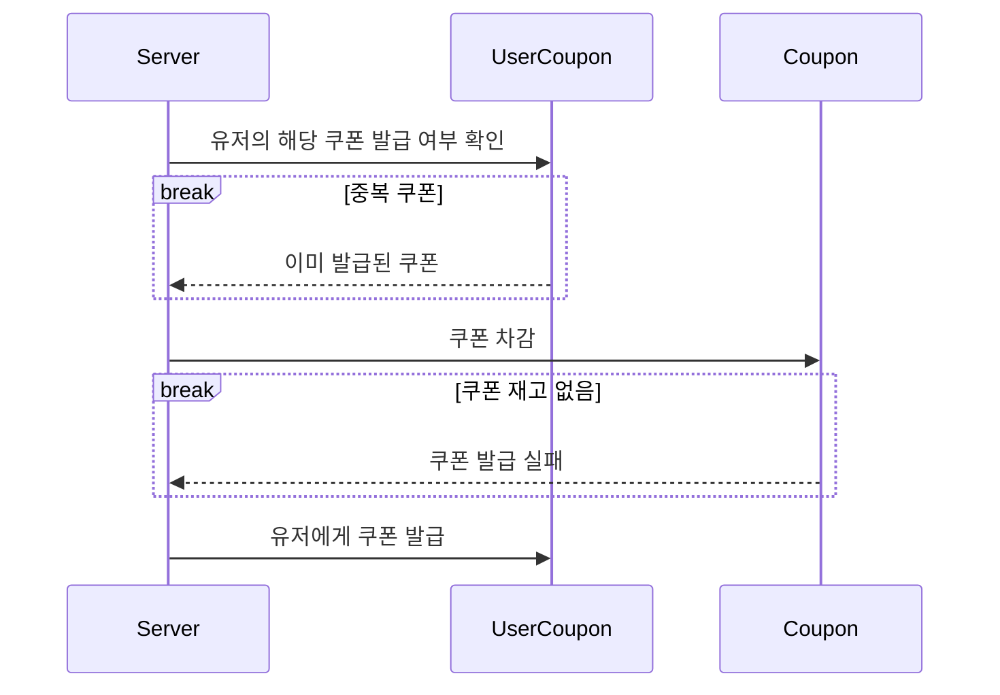
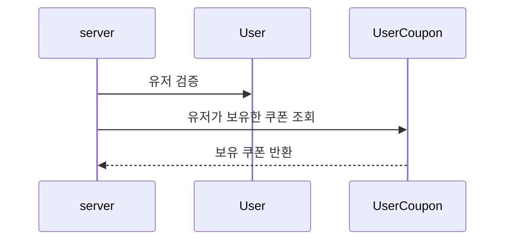
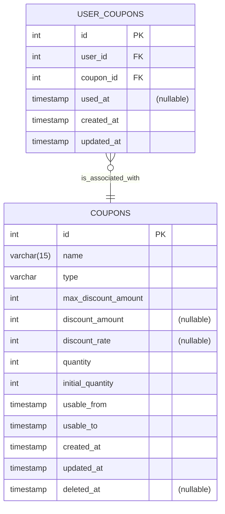

# 선착순 쿠폰

## 1. 시퀀스 다이어그램

### 1.1 쿠폰 발급

- 유저는 쿠폰당 1개씩 밖에 갖지 못한다고 제한했습니다.
- 중복 쿠폰 확인부터 유저에게 쿠폰 발급까지 하나의 트랜잭션으로 묶인다고 가정했습니다.

### 1.2 보유 쿠폰 조회

- 쿠폰 발급시, 해당 유저 아이디가 실제 있는 유저인지 검증합니다.
- 사용이 가능한 쿠폰을 반환합니다. 

## 2.5.1 ERD

- COUPONS
  - 쿠폰은 정액 할인과, 정률 할인을 나타내는 TYPE(`FIXED`와 `PERCENTAGE`)로 구분됩니다.
  - 쿠폰에서 재고를 관리합니다. 
- USER_COUPONS 
  - USER_COUPONS 조회시 할인 규칙은 COUPONS에서 확인합니다
- 쿠폰 사용 제약
  - 쿠폰은 발급된 후, 사용기한(COUPONS.USABLE_FROM ~ USABLE_TO)이 지나면 사용할 수 없습니다.
  - 쿠폰은 최대 금액 범위 내에서 할인이 제공됩니다.
  - 사용 가능한 쿠폰이란, 사용 기한 내에 있으며, USER_COUPONS.USED_AT이 NULL인 쿠폰을 의미합니다.
