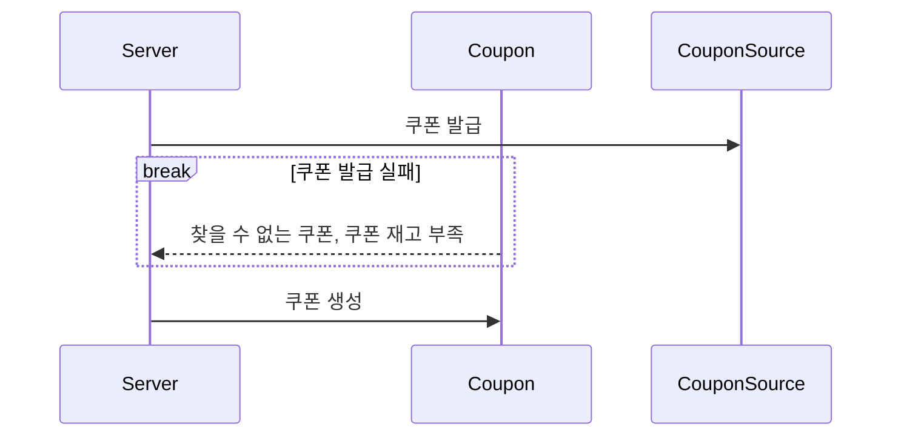
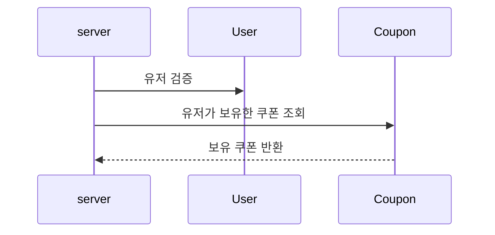
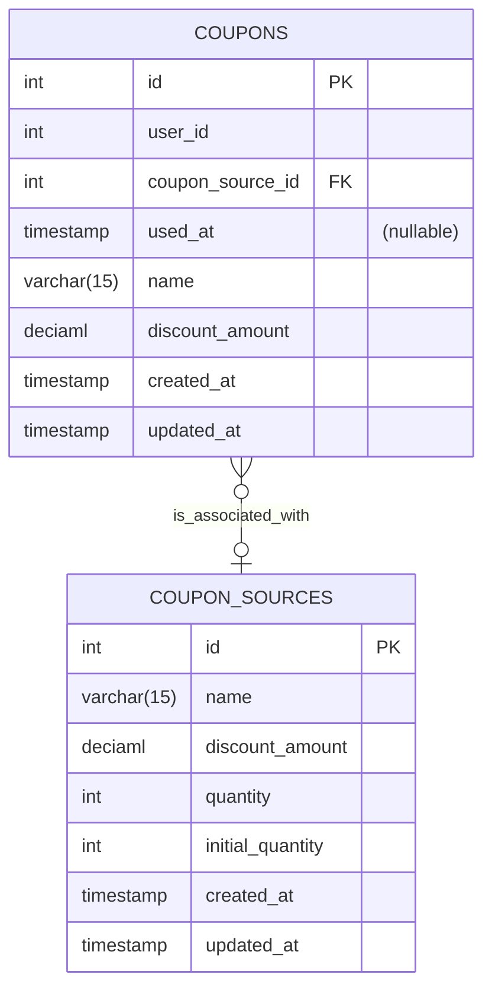

# 선착순 쿠폰

## 1. 시퀀스 다이어그램

### 1.1 쿠폰 발급

### 1.2 보유 쿠폰 조회

- 쿠폰 발급시, 해당 유저 아이디가 실제 있는 유저인지 검증합니다.
- 아직 사용 되지 않은 쿠폰을 반환합니다. 

## 2. ERD

- COUPON_SOURCES
  - 쿠폰 소스에서 재고를 관리합니다. 
- COUPONS 
  - COUPONS 생성시 할인 규칙은 COUPONS에서 중복으로 저장합니다.
