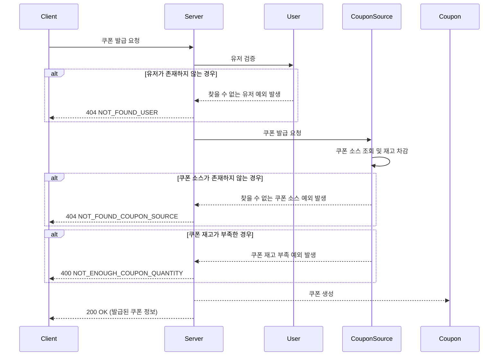
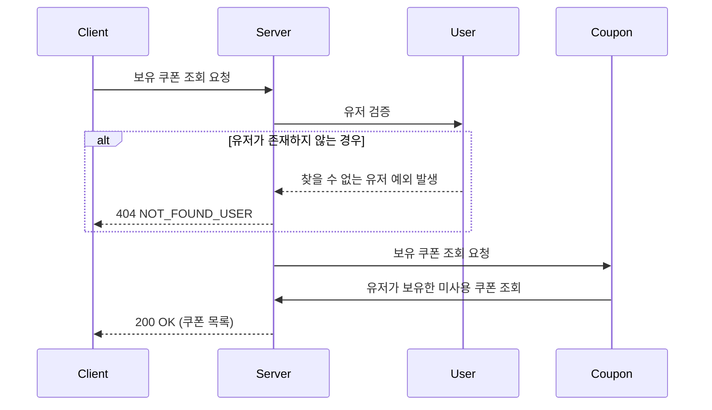
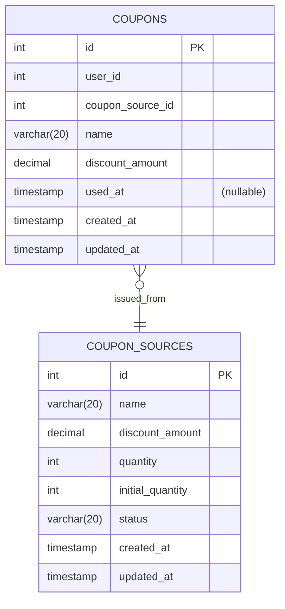

# 선착순 쿠폰 발급 / 쿠폰 조회

선착순 쿠폰을 발급 하고, 사용자의 발급받은 자신의 쿠폰을 조회할 수 있다.

## 1. 기능 설명

### 1.1 쿠폰 발급
사용자에게 쿠폰을 발급합니다. 발급 과정에서 쿠폰 소스의 재고를 확인하고 차감합니다.

#### 시퀀스 다이어그램

### 1.2 보유 쿠폰 조회
사용자가 보유한 쿠폰 목록을 조회합니다. 사용하지 않은 쿠폰만 반환합니다.

#### 시퀀스 다이어그램

## 3. 데이터 모델 (ERD)

### 엔티티 설명
- **COUPONS**: 사용자에게 발급된 쿠폰 정보를 저장하는 테이블
    - `id`: 쿠폰 고유 식별자
    - `user_id`: 사용자 ID
    - `coupon_source_id`: 쿠폰 소스 ID
    - `name`: 쿠폰 이름
    - `discount_amount`: 할인 금액
    - `used_at`: 쿠폰 사용 시각 (nullable)
    - `created_at`: 쿠폰 생성 시각
    - `updated_at`: 쿠폰 수정 시각
- **COUPON_SOURCES**: - 쿠폰 발급의 기준이 되는 쿠폰 소스 정보를 저장하는 테이블
    - `id`: 쿠폰 소스 고유 식별자
    - `name`: 쿠폰 소스 이름
    - `discount_amount`: 쿠폰 소스 할인 금액
    - `quantity`: 쿠폰 소스 재고 수량
    - `initial_quantity`: 쿠폰 소스 초기 재고 수량
    - `status`: 쿠폰 소스 상태 (ACTIVE, INACTIVE)
    - `created_at`: 쿠폰 소스 생성 시각
    - `updated_at`: 쿠폰 소스 수정 시각

## 3. 구현 세부 사항

### 3.1 쿠폰 사용 제한 
- 쿠폰은 한 번만 사용할 수 있습니다.
- 쿠폰은 발급받은 사용자만 사용할 수 있습니다.
- 선착순 쿠폰은 쿠폰 소스의 수량이 모두 소진되면 더 이상 발급할 수 없습니다.
