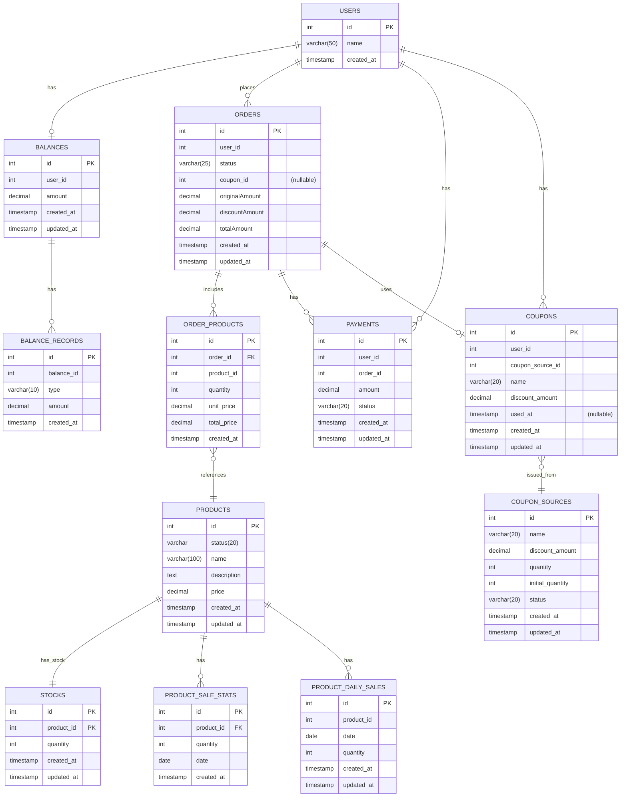

```mermaid
erDiagram
    USERS {
        int id PK
        varchar(50) name
        timestamp created_at
    }
    BALANCES {
        int id PK
        int user_id
        decimal amount
        timestamp created_at
        timestamp updated_at
    }
    BALANCE_RECORDS {
        int id PK
        int balance_id
        varchar(10) type
        decimal amount
        timestamp created_at
    }

    ORDERS {
        int id PK
        int user_id
        varchar(25) status
        int coupon_id "(nullable)"
        decimal originalAmount
        decimal discountAmount
        decimal totalAmount
        timestamp created_at
        timestamp updated_at
    }
    ORDER_PRODUCTS {
        int id PK
        int order_id FK
        int product_id
        int quantity
        decimal unit_price
        decimal total_price
        timestamp created_at
    }

    PRODUCTS {
        int id PK
        varchar status(20)
        varchar(100) name
        text description
        decimal price
        timestamp created_at
        timestamp updated_at
    }
    STOCKS {
        int id PK
        int product_id PK
        int quantity
        timestamp created_at
        timestamp updated_at
    }
    PRODUCT_SALE_STATS {
        int id PK
        int product_id FK
        int quantity
        date date
        timestamp created_at
    }
    PRODUCT_DAILY_SALES {
        int id PK
        int product_id
        date date
        int quantity
        timestamp created_at
        timestamp updated_at
    }

    PAYMENTS {
        int id PK
        int user_id
        int order_id
        decimal amount
        varchar(20) status
        timestamp created_at
        timestamp updated_at
    }

    COUPONS {
        int id PK
        int user_id
        int coupon_source_id
        varchar(20) name
        decimal discount_amount
        timestamp used_at "(nullable)"
        timestamp created_at
        timestamp updated_at
    }
    COUPON_SOURCES {
        int id PK
        varchar(20) name
        decimal discount_amount
        int quantity
        int initial_quantity
        varchar(20) status
        timestamp created_at
        timestamp updated_at
    }

    USERS one to one or zero BALANCES: has
    USERS one to zero or more ORDERS: places
    USERS one to many PAYMENTS: has
    USERS one to many COUPONS: has
    
    BALANCES one to many BALANCE_RECORDS: has
    
    ORDERS one to many ORDER_PRODUCTS: includes
    ORDER_PRODUCTS many to one PRODUCTS: references

    PRODUCTS one to one STOCKS: has_stock
    PRODUCTS one to zero or more PRODUCT_SALE_STATS : has
    PRODUCTS one to zero or more PRODUCT_DAILY_SALES: has

    ORDERS one to many PAYMENTS: has
    ORDERS one to zero or one COUPONS : uses
    COUPONS zero or more to one COUPON_SOURCES: issued_from
```
