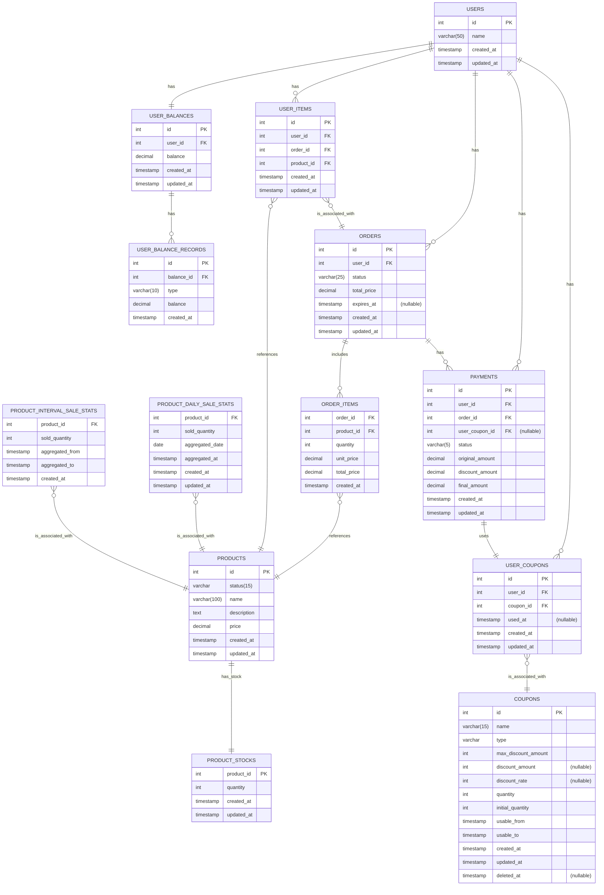

```mermaid
erDiagram
    USERS {
        int id PK
        varchar(50) name
        timestamp created_at
        timestamp updated_at
    }
    USER_BALANCES {
        int id PK
        int user_id FK
        decimal balance
        timestamp created_at
        timestamp updated_at
    }
    USER_BALANCE_RECORDS {
        int id PK
        int balance_id FK
        varchar(10) type
        decimal balance
        timestamp created_at
    }

    ORDERS {
        int id PK
        int user_id FK
        varchar(25) status
        decimal total_price
        timestamp expires_at "(nullable)"
        timestamp created_at
        timestamp updated_at
    }
    ORDER_ITEMS {
        int order_id FK
        int product_id FK
        int quantity
        decimal unit_price
        decimal total_price
        timestamp created_at
    }

    PRODUCTS {
        int id PK
        varchar status(15)
        varchar(100) name
        text description
        decimal price
        timestamp created_at
        timestamp updated_at
    }
    PRODUCT_STOCKS {
        int product_id PK
        int quantity
        timestamp created_at
        timestamp updated_at
    }

    PAYMENTS {
        int id PK
        int user_id FK
        int order_id FK
        int user_coupon_id FK "(nullable)"
        varchar(5) status
        decimal original_amount
        decimal discount_amount
        decimal final_amount
        timestamp created_at
        timestamp updated_at
    }
    
    USER_COUPONS {
        int id PK
        int user_id FK
        int coupon_id FK
        timestamp used_at "(nullable)"
        timestamp created_at
        timestamp updated_at
    }
    COUPONS {
        int id PK
        varchar(15) name
        varchar type
        int max_discount_amount
        int discount_amount "(nullable)"
        int discount_rate "(nullable)"
        int quantity
        int initial_quantity
        timestamp usable_from
        timestamp usable_to
        timestamp created_at
        timestamp updated_at
        timestamp deleted_at "(nullable)"
    }

    USER_ITEMS {
        int id PK
        int user_id FK
        int order_id FK
        int product_id FK
        timestamp created_at
        timestamp updated_at
    }

    PRODUCT_INTERVAL_SALE_STATS {
        int product_id FK
        int sold_quantity
        timestamp aggregated_from
        timestamp aggregated_to
        timestamp created_at
    }
    PRODUCT_DAILY_SALE_STATS {
        int product_id FK
        int sold_quantity
        date aggregated_date
        timestamp aggregated_at
        timestamp created_at
        timestamp updated_at
    }
    
    
    USERS one to one USER_BALANCES: has
    USERS one to many ORDERS: has
    USERS one to many PAYMENTS: has
    USERS one to many USER_COUPONS: has
    USERS one to many USER_ITEMS: has
    
    USER_BALANCES one to many USER_BALANCE_RECORDS: has
    
    ORDERS one to many ORDER_ITEMS: includes
    ORDER_ITEMS many to one PRODUCTS: references

    PRODUCTS one to one PRODUCT_STOCKS: has_stock

    ORDERS one to many PAYMENTS: has
    PAYMENTS one to one USER_COUPONS: uses
    USER_COUPONS many to one COUPONS: is_associated_with

    USER_ITEMS many to one ORDERS: is_associated_with
    USER_ITEMS many to one PRODUCTS: references

    PRODUCT_DAILY_SALE_STATS many to one PRODUCTS: is_associated_with
    PRODUCT_INTERVAL_SALE_STATS many to one PRODUCTS: is_associated_with
```
