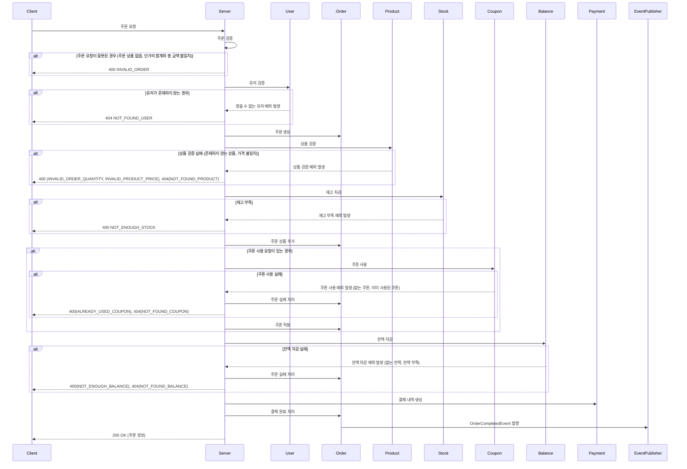
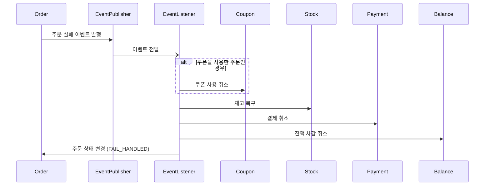
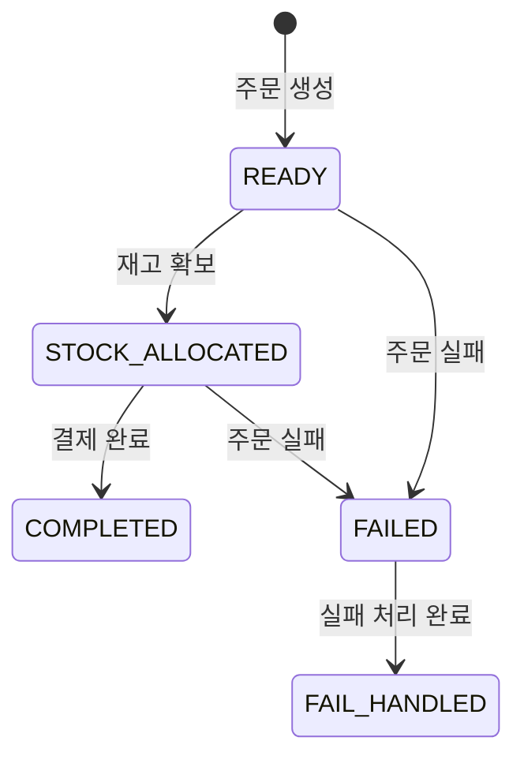
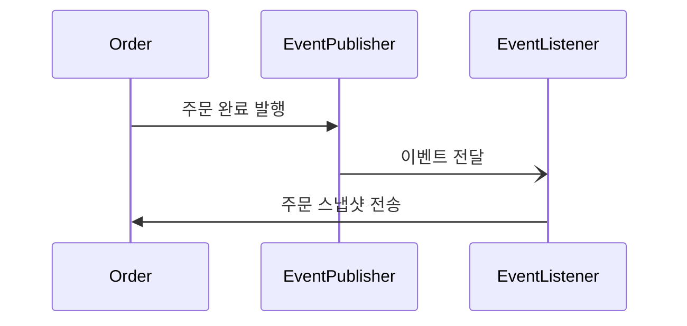
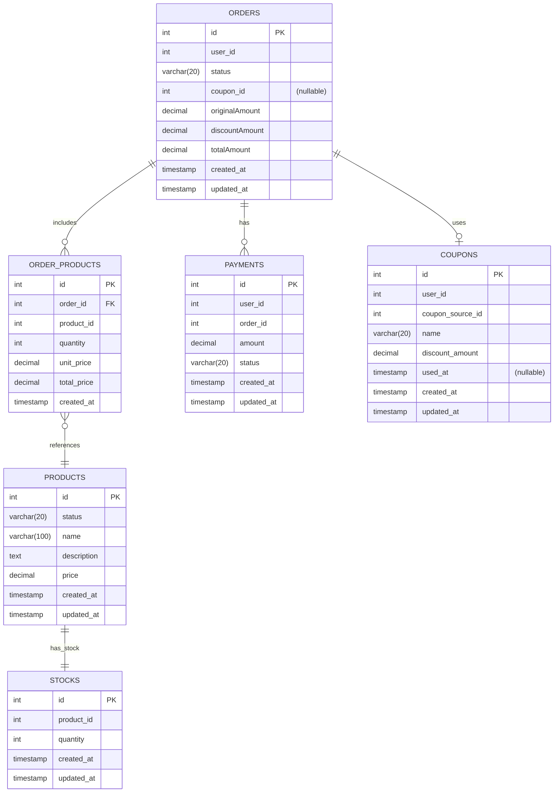

# 주문 & 결제 & 주문 데이터 전송

- 사용자는 상품을 주문하고 결제할 수 있습니다.
- 주문 과정에서는 상품 재고 확보, 쿠폰 적용, 결제 처리 등의 단계가 포함됩니다.
- 완료된 주문 데이터를 외부 시스템으로 전송 됩니다.

## 1. 주문 & 결제 프로세스

### 1.1 주문 & 결제 흐름

#### 시퀀스 다이어그램

#### 주요 처리 로직
1. **유저 검증**
    - 주문 요청 시 유저 ID가 실제 존재하는지 검증합니다.
    - 존재하지 않는 유저인 경우 404 에러를 반환합니다.

2. **주문 생성**
    - 초기 상태(READY)의 주문을 생성합니다.
    - 이 시점에서는 주문 상품, 금액 등의 정보가 아직 없습니다.

3. **상품 검증**
    - 주문 정보와 상품 정보를 대조합니다.

4. **상품 재고 차감**
    - 주문할 상품의 재고를 확인하고 차감합니다.
    - 재고를 먼저 차감한 후 결제를 진행하여, 결제 성공 후 재고 부족으로 환불해야 하는 상황을 방지합니다.
    - 재고가 부족한 경우 400 에러를 반환합니다.

5. **주문 상품 등록**
    - 확보한 재고를 주문 상품으로 등록합니다.
    - 주문 상태를 STOCK_ALLOCATED로 변경합니다.
    - 확정된 주문 상품을 바탕으로 주문 금액을 계산합니다.
    - 할인 금액은 주문 총액을 초과할 수 없습니다.

6. **쿠폰 적용** (선택적)
    - 쿠폰 사용 요청이 있는 경우, 쿠폰을 사용 처리합니다.
    - 이미 사용된 쿠폰인 경우 400 에러를 반환합니다.
    - 쿠폰 적용 시 할인 금액을 계산하여 주문 금액에서 차감합니다.

7. **결제**
    - 사용자의 잔액에서 최종 결제 금액을 차감합니다.
    - 잔액이 부족한 경우 400 에러를 반환합니다.
    - 결제 내역을 생성합니다.

8. **주문 완료**
    - 주문 상태를 COMPLETED로 변경합니다.
    - OrderCompletedEvent를 발행하여 주문 완료 처리를 알립니다.
    - 이 이벤트는 외부 데이터 플랫폼에 주문 정보 전송, 상품 통계 데이터 생성 등에 사용됩니다.

### 1.2 주문 실패 처리

#### 시퀀스 다이어그램

#### 주요 처리 로직
1. **이벤트 발행**
    - 주문을 실패하면 주문 실패 이벤트를 발행합니다.
    - 이벤트에는 주문 ID와 주문 스냅샷 정보가 포함됩니다.

2. **이벤트 리스너**
    - 이벤트 리스너는 주문 트랜잭션 완료 후 이벤트를 처리합니다.

3. **주문 취소 처리**
    - 실패한 주문에 대해서는 다음과 같은 후속 처리를 수행합니다
      1. 쿠폰을 사용한 경우, 쿠폰 사용을 취소합니다.
      2. 차감한 재고를 복구합니다.
      3. 결제가 이루어진 경우, 결제를 취소하고 잔액을 환불합니다.
    - 모든 처리가 성공하면 주문 상태를 FAIL_HANDLED로 변경합니다.

### 1.3 주문 상태 흐름

- **READY**: 주문이 생성된 초기 상태
- **STOCK_ALLOCATED**: 상품 재고가 확보된 상태
- **COMPLETED**: 결제가 완료되어 주문이 성공적으로 처리된 상태
- **FAILED**: 주문 처리 중 오류가 발생하여 실패한 상태
- **FAIL_HANDLED**: 실패한 주문에 대한 후속 처리(재고 복구, 쿠폰 사용 취소 등)가 완료된 상태

## 2. 주문 데이터 전송

### 2.1 주문 데이터 전송 흐름

#### 시퀀스 다이어그램

#### 주요 처리 로직
1. **이벤트 발행**
    - 주문이 완료되면 완료 발행합니다.
    - 이벤트에는 주문 ID와 주문 스냅샷 정보가 포함됩니다.

2. **이벤트 리스너**
    - 이벤트 리스너는 주문 트랜잭션 완료 후 이벤트를 처리합니다.

3. **데이터 전송**
    - 외부 시스템으로 주문 데이터를 전송합니다.

## 3. 데이터 모델 (ERD)

### 3.1 주문 & 결제 관련 엔티티

### 3.2 엔티티 설명

#### ORDERS
- 주문 정보를 저장하는 테이블
- `id`: 주문 고유 식별자
- `user_id`: 주문한 사용자 ID
- `status`: 주문 상태 (READY, STOCK_ALLOCATED, COMPLETED, FAILED, FAIL_HANDLED)
- `coupon_id`: 적용된 쿠폰 ID (nullable)
- `originalAmount`: 할인 전 원래 금액
- `discountAmount`: 할인 금액
- `totalAmount`: 최종 결제 금액 (originalAmount - discountAmount)
- `created_at`: 주문 생성 시각
- `updated_at`: 주문 수정 시각

#### ORDER_PRODUCTS
- 주문에 포함된 상품 정보를 저장하는 테이블
- `id`: 주문 상품 고유 식별자
- `order_id`: 주문 ID
- `product_id`: 상품 ID
- `quantity`: 주문 수량
- `unit_price`: 단위 가격 (주문 시점의 가격)
- `total_price`: 총 가격 (unit_price * quantity)
- `created_at`: 생성 시각

#### PAYMENTS
- 결제 정보를 저장하는 테이블
- `id`: 결제 고유 식별자
- `user_id`: 결제한 사용자 ID
- `order_id`: 결제한 주문 ID
- `amount`: 결제 금액
- `created_at`: 결제 시각
