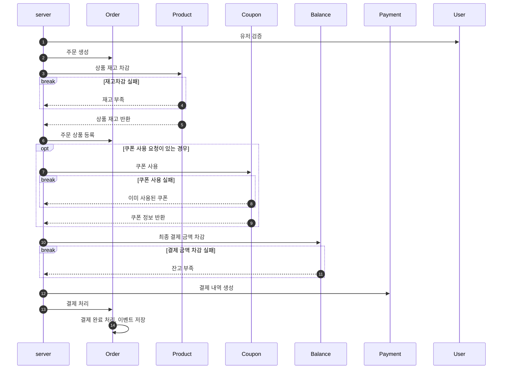
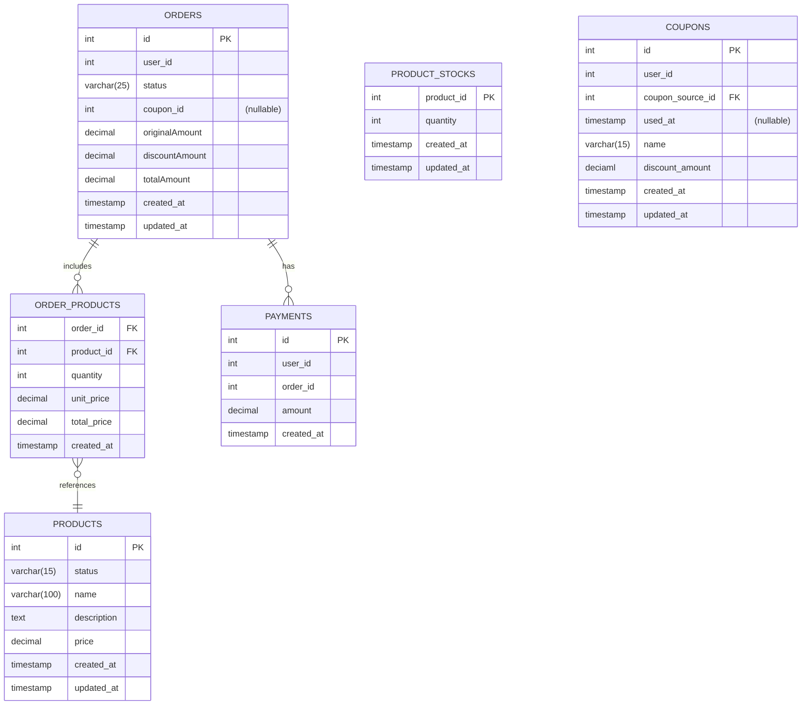
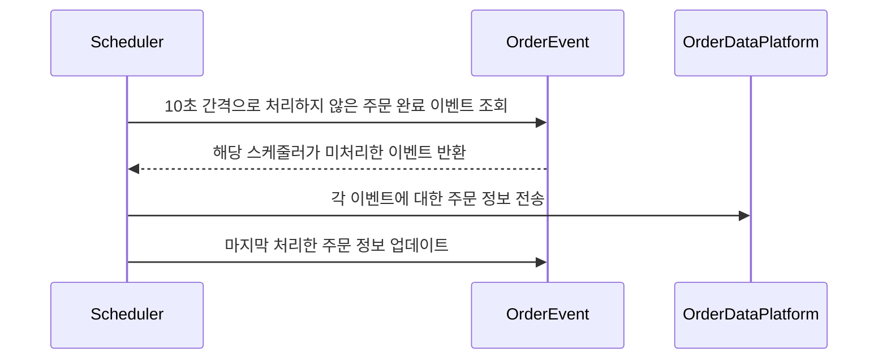
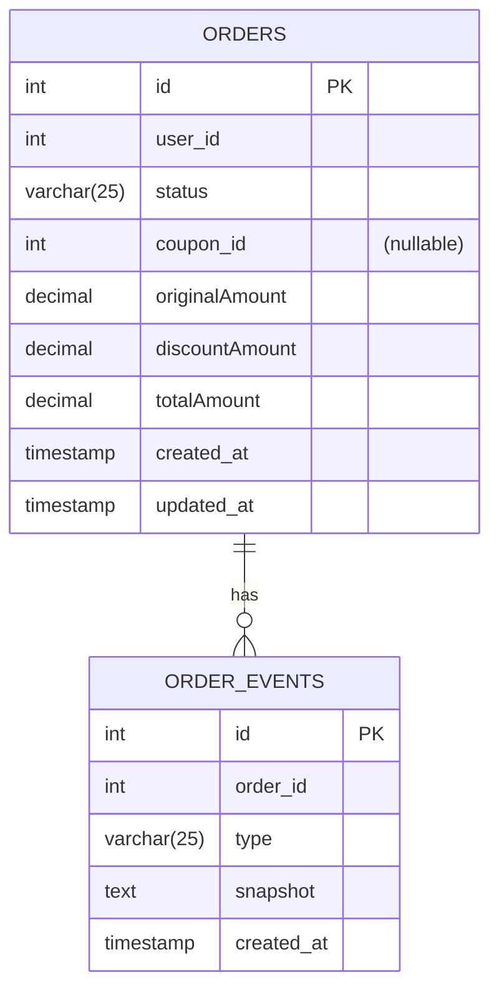

# 주문 & 결제 & 완료된 주문 데이터 전송

- 주문과 결제를 진행합니다.
- 완료된 주문에 대해서는 일정 주기로 데이터를 전송합니다.

## 1. 주문& 결제
### 1.1 주문& 결제 시퀀스 다이어그램

- (1) 유저 검증을 진행합니다.
- (2) 주문을 생성합니다.
- (3) 상품 재고를 차감합니다.
  - 재고를 먼저 차감한 후, 결제를 진행합니다.
  - 결제 성공 후 재고 부족으로 환불 해야하는 상황을 막기 위함입니다.
- (6) 주문 상품을 등록합니다.
  - 확보한 재고를 주문 상품으로 등록합니다.
- (7) 쿠폰 사용 요청이 있는 경우, 쿠폰을 사용합니다.
- (8) 이미 사용된 쿠폰은 사용하지 못합니다.
- (10) 잔고에서 최종 결제 금액을 차감합니다.
- (11) 잔고가 부족한 경우 결제가 실패합니다.
- (12) 결제 내역을 생성합니다.
- (13) 주문을 결제 완료 처리합니다.
- (14) 완료된 주문에 대한 이벤트를 저장합니다
  - 저장된 이벤트는 외부 데이터 플랫폼에 주문 정보 전송, 상품 통계 데이터에 사용됩니다.

### 1.2 주문 & 결제 ERD

- ORDER_ITEMS
  - 한 번에 여러 상품을 주문할 수 있기 떄문에 ORDER_ITEMS에 상품 별 주문을 관리합니다.
  - 가격 변동이 있을 수 있으므로, 주문 시점의 가격을 ORDER_ITEMS에 저장합니다.
- ORDER_ITEMS
  - 한 번에 여러 상품을 주문할 수 있기 떄문에 ORDER_ITEMS에 상품 별 주문을 관리합니다.
  - 가격 변동이 있을 수 있으므로, 주문 시점의 가격을 ORDER_ITEMS에 저장합니다.
- ORDER.STATUS
  - `READY(주문대기)`, `STOCK_ALLOCATED(재고 확보)`, `COMPLETED(주문완료)` 로 구분됩니다
- PAYMENTS
    - 하나의 주문에 여러 번의 결제를 시도할 수 있으므로, ORDERS와 PAYMENTS는 1:N 관계로 설정했습니다.

## 2. 완료된 주문 데이터 전송

### 2.1. 주문 데이터 전송 : 시퀀스 다이어그램

### 2.2 주문 데이터 전송 : ERD

- ORDER_EVENTS
  - 주문의 현재 상태를 snapshot으로 저장합니다.
