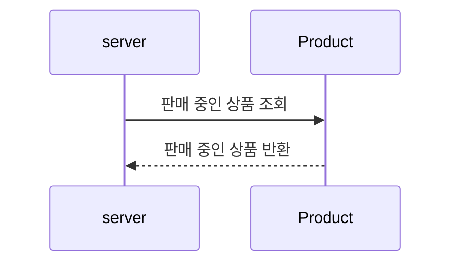
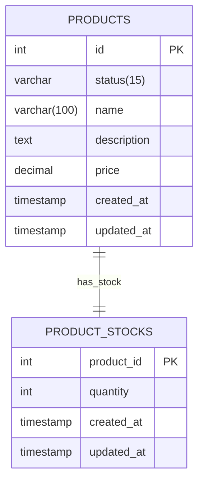
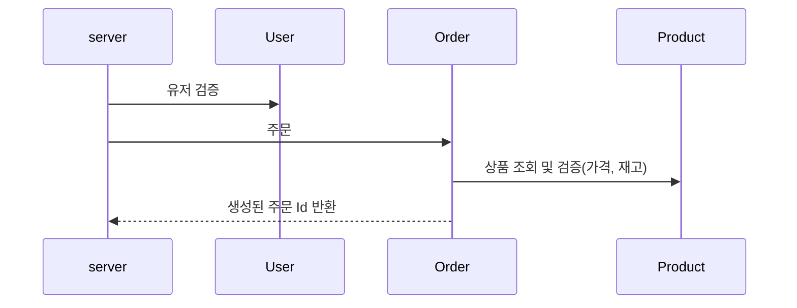
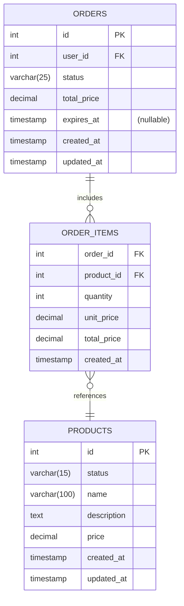

# 상품 조회-주문
상품을 조회하고, 그 중 여러 개를 선택하여 주문할 수 있는 기능입니다.

## 1. 상품 목록 조회

### 1.1. 상품 목록 조회 : 시퀀스 다이어그램

- 상품 중 '판매 중'인 상품만 조회합니다.

### 1.2 상품 목록 조회 : ERD

- 상태는 `INACTIVE`(판매중지), `ON_SALE`(판매중)으로 구분됩니다.
- 상품 조회시 조회 되는 '판매 중'인 상품이란, 상태가 `ON_SALE`인 상품을 의미합니다.
  - 재고가 0인 상품도 조회됩니다.
    - 판매가 중지된 것은 아니며, 재고가 채워질 수 있기 때문입니다.
    

## 2. 주문

### 2.1 주문 : 시퀀스 다이어그램

- 주문시, 해당 유저 아이디가 실제 있는 유저인지 검증합니다.
- 주문 생성 전에, 상품을 검증합니다.
  - 요청 가격과 상품의 가격이 일치하는지 검증합니다.
  - 요청 수량만큼 재고가 있는지 검증합니다. 
  - 검증에 실패하면 에러가 발생합니다 
- 주문에 성공하면, 생성한 주문 Id를 반환합니다.

### 2.2 주문 : ERD

- ORDER_ITEMS
  - 한 번에 여러 상품을 주문할 수 있기 떄문에 ORDER_ITEMS에 상품 별 주문을 관리합니다.
  - 가격 변동이 있을 수 있으므로, 주문 시점의 가격을 ORDER_ITEMS에 저장합니다.
- ORDER.STATUS 
  - `READY(주문대기)`, `STOCK_ALLOCATED(재고 확보)`, `STOCK_ALLOCATION_FAILED(재고 확보 실패)`, `PAID(결제완료)`, `PAYMENT_FAILED(결제 실패)`,`DELIVERED(유저에게 전달)`, `DELIVERY_FAILED(유저에게 전달 실패)`, `COMPLETED(주문완료)` 로 구분됩니다
  - 주문 과정에서 어느 곳에서 실패했는지 파악할 수 있도록 상태를 세분화 했습니다
- ORDER.EXPIRES_AT 주문 만료시각
  - 주문 API와 결제 API를 분리했기 때문에 만료시각을 두고, 만료시각 이후에는 결제 할 수 없다는 제약을 추가했습니다.
  - 주문 생성시 만료시각을 지정되며, 결제 완료시 만료시각은 null로 변경됩니다.
