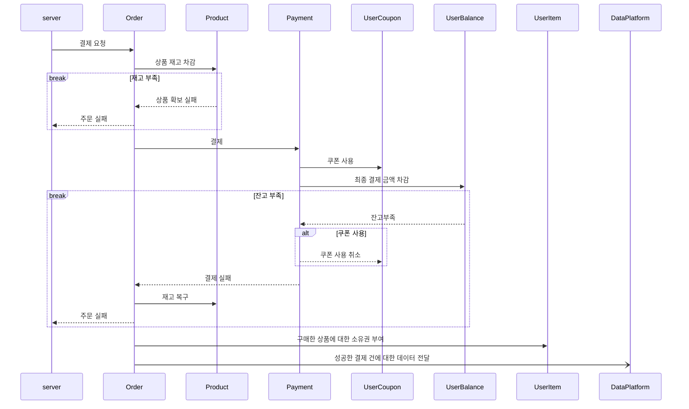
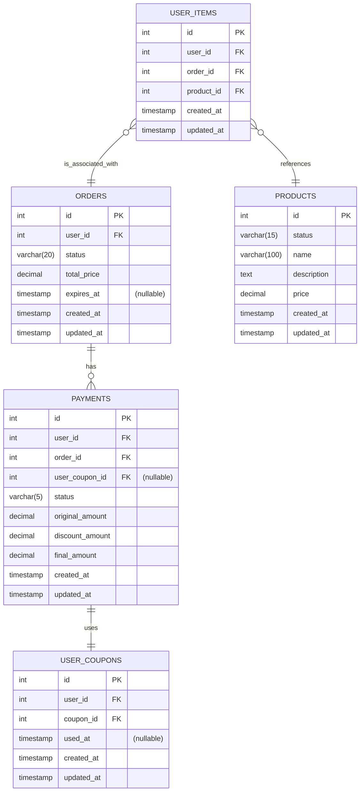

# 결제

결제를 진행하고, 유저는 주문 상품에 대한 소유권을 얻습니다.

## 1. 시퀀스 다이어그램

- 재고 차감 전, 주문 검증을 진행합니다.
    - 요청으로 받은 유저 Id가 해당 주문의 소유주인지 확인합니다.
    - 주문의 결제 만료 시각을 지나지 않았는지, `READY` 상태인지 확인합니다.
- 재고를 먼저 차감한 후, 결제를 진행합니다.
    - 결제 성공 후 재고 부족으로 환불 해야하는 상황을 막기 위함입니다.
- 결제 실패시 대응
    - 결제 실패시, 쿠폰을 사용했다면 쿠폰 사용을 취소합니다.
    - 결제 실패시, 상품 재고를 복구합니다.
- 요구 사항에 따라, 외부 데이터 플랫폼으로 성공한 결제 건에 대한 데이터를 비동기로 전송합니다.

## 2. ERD

- PAYMENTS
    - 하나의 주문에 여러 번의 결제를 시도할 수 있으므로, ORDERS와 PAYMENTS는 1:N 관계로 설정했습니다.
- 쿠폰 사용
    - 결제 한 건에, 쿠폰 한 건만 사용할 수 있도록 1:1 관계로 설정했습니다.
- ORDERS.STATUS
    - 재고 확보시 `STOCK_ALLOCATE`가 되며, 실패시 `STOCK_ALLOCATION_FAIL`가 됩니다.
    - 결제 성공시 ORDERS.STATUS는 `PAID`가 되며, 실패시 `PAY_FAILED`가 됩니다.
    - 유저에게 전달 성공시 `DELIVERED`가 되며, 실패시 `DELIVERY_FAIL`가 됩니다.
    - 최종 결제가 완료되면 `COMPLETED`가 됩니다.
- USER_ITEMS
    - 구매 완료 후, 유저에게 상품을 주는 것을 간단하게 USER_ITEM을 생성하는 것으로 작성했습니다.
    - 소유권이고 낱개로 관리해야 한다 생각해 상품 한 개당 하나의 row를 가지도록 설계했습니다.
        - ex) A라는 상품을 3개 구매하면, USER_ITEMS에 3개의 row가 생성됩니다.
