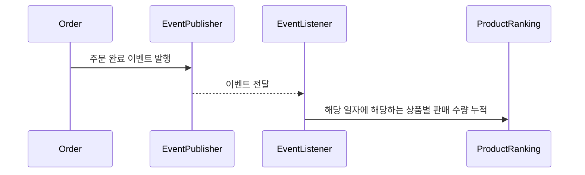
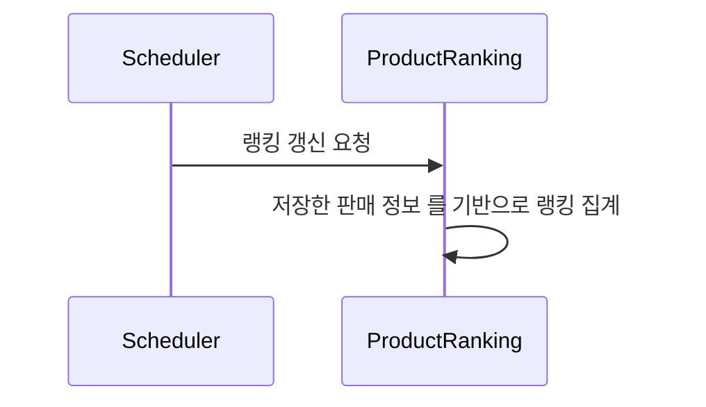
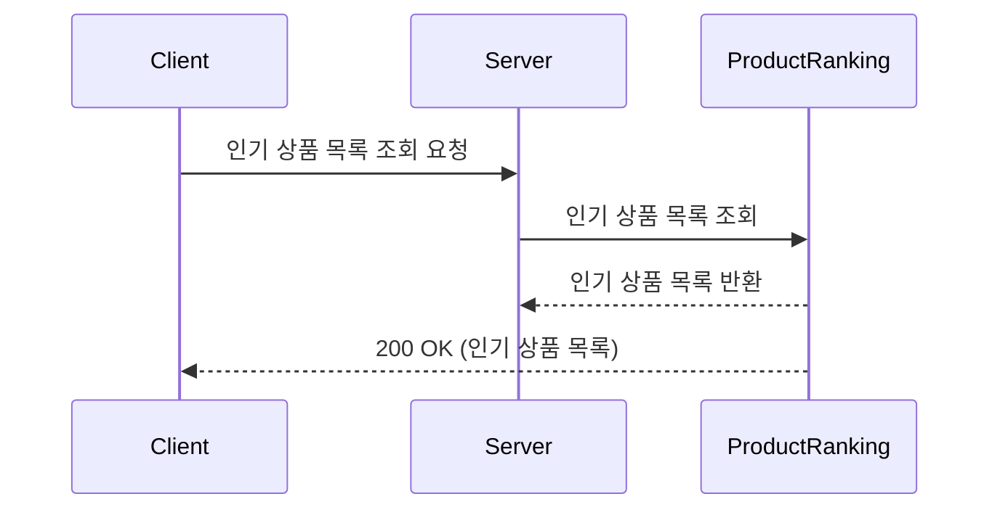

# 인기 상품 랭킹 시스템

- 주문 완료 이벤트를 기반으로 상품별 판매 점수를 Redis에 저장
- 주기적인 랭킹 갱신을 통해 최근 인기 상품 랭킹을 제공

## 1. 주문 이벤트 기반 판매 점수 저장 

### 1.1 저장 구조
- Redis Sorted Set을 사용하여 상품별 판매 점수를 저장합니다.
- key: product:sale:rank:{판매날짜}
- value: 상품ID
- score: 판매수량 + 주문수
  - 판매수가 동일할 경우, 주문이 많은 상품이 랭킹이 높습니다.

## 2. 인기 상품 랭킹 집계

- Scheduler에 의해 5분마다 랭킹이 갱신됩니다.
- 랭킹 정보는 캐시에 저장합니다. 
- 캐시의 만료 시간은 10분으로, 캐시 만료전 스케줄러에 의해 갱신되어, 캐시 만료로 인한 성능 저하를 방지합니다.

## 3. 인기 상품 조회
최근 판매량이 많은 인기 상품을 조회하는 기능입니다. 최근 3일간의 일간 판매 통계 데이터를 기반으로 상위 5개의 인기 상품 정보를 제공합니다.

#### 시퀀스 다이어그램

#### 주요 처리 로직
- **인기 상품 기준**
  - 최근 3일간(오늘 포함, 2일 전까지) 판매량이 많은 상위 5개 상품을 인기 상품으로 정의합니다.
    - 예를 들어, 오늘이 4월 5일이라면, 4월 3일부터 4월 5일까지의 판매량을 기준으로 합니다.
- **캐싱 전략**
  - 인기 상품 ID 목록을 캐싱해 성능을 향상시킵니다.
  - 랭킹이 재집계 될 때마다 캐시가 갱신됩니다.
