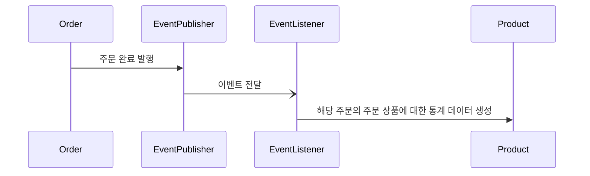
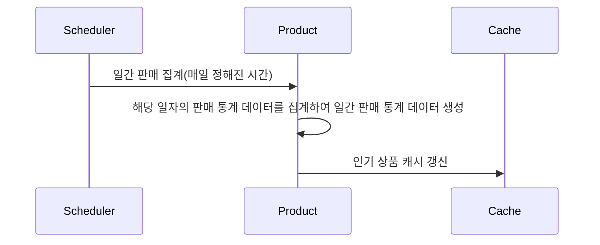
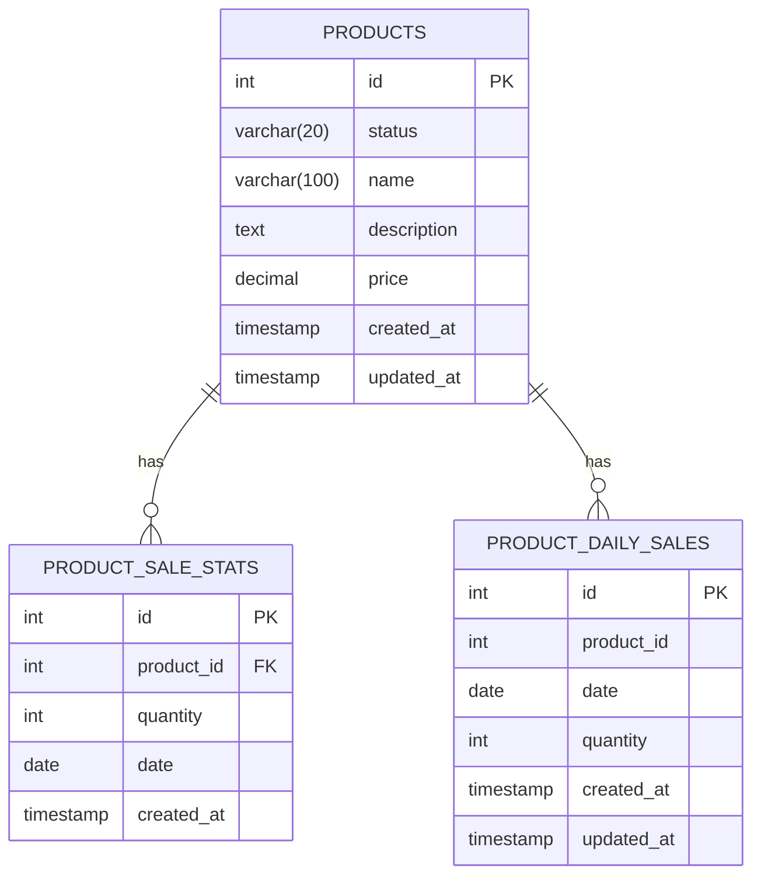

# 상품 판매 통계

주문 완료 이벤트를 기반으로 상품 판매 통계 데이터가 생성됩니다. 

## 1. 상품 판매 통계 데이터 생성

### 1.1 기능 설명
주문 완료 이벤트를 기반으로 상품 판매 통계 데이터를 생성하는 기능입니다. 이 데이터는 인기 상품 조회에 활용됩니다.

#### 판매 통계 데이터 생성

#### 일별 판매 데이터 집계

#### 주요 처리 로직
- **이벤트 기반 통계 생성**
    - 주문이 완료되면 주문 완료 이벤트가 발행됩니다.
    - 주문 완료 이벤트를 수신하면, 상품 판매 통계 데이터를 생성합니다.

- **일별 집계 처리**
    - 스케줄러에 의해 매일 판매량 일별 집계 작업이 실행됩니다.
    - 개별 판매 통계 데이터를 날짜별, 상품별로 집계합니다.
    - 집계 작업 완료 후 인기 상품 캐시가 갱신됩니다.

## 2. 데이터 모델 (ERD)

### 2.1 엔티티 설명

#### PRODUCT_SALE_STATS
- 개별 상품 판매 데이터를 저장하는 테이블
- `id`: 통계 데이터 고유 식별자
- `product_id`: 상품 ID (외래 키)
- `quantity`: 판매 수량
- `date`: 판매 날짜
- `created_at`: 생성 시간

#### PRODUCT_DAILY_SALES
- 상품 일별 판매량을 저장하는 테이블
- `id`: 일별 판매량 고유 식별자
- `product_id`: 상품 ID
- `date`: 판매 날짜
- `quantity`: 판매 수량
- `created_at`: 생성 시간
- `updated_at`: 수정 시간
