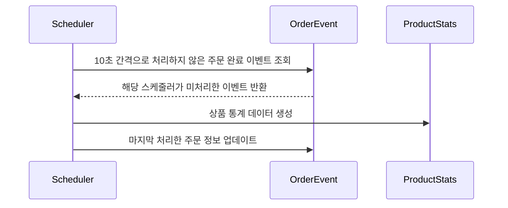
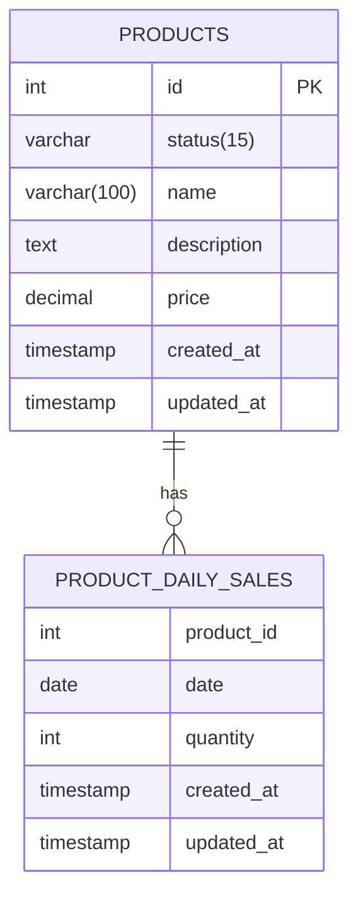
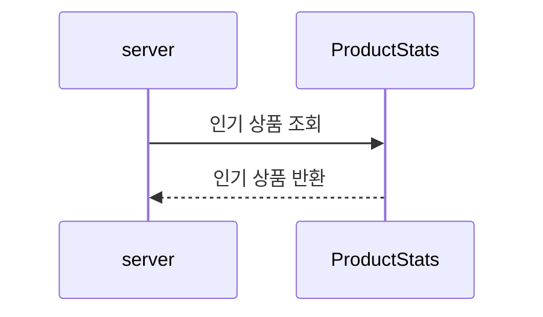

# 상위 상품 통계/조회

## 1. 통계 데이터 생성

- 인기 상품 의미 
  - 최근 3일간 가장 많이 팔린 상위 5개 상품 정보를 제공합니다.
    - 최근 3일은 조회일 기준 2일 전부터 오늘까지의 기간을 의미합니다.
      - ex) 오늘이 4월 3일이라면, 4월 1일부터 현재(마지막 배치 적용 시각)까지의 기간을 의미합니다.
    - 당일 급격하게 판매가 증가한 상품을 반영하기 위해, 최근 3일의 범위에 당일을 포함했습니다.
- 기준 이벤트
  - 주문 완료 이벤트를 기준으로 합니다.

- 통계 데이터 
  - '날짜 + 상품 아이디' 별로 판매량을 저장합니다.

## 1.2 인기 상품 조회  

