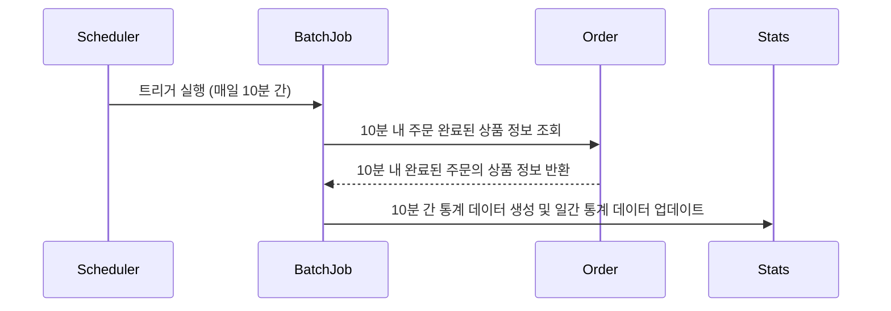
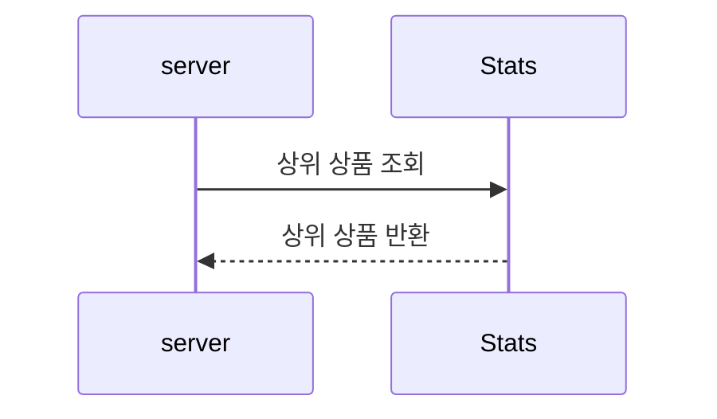
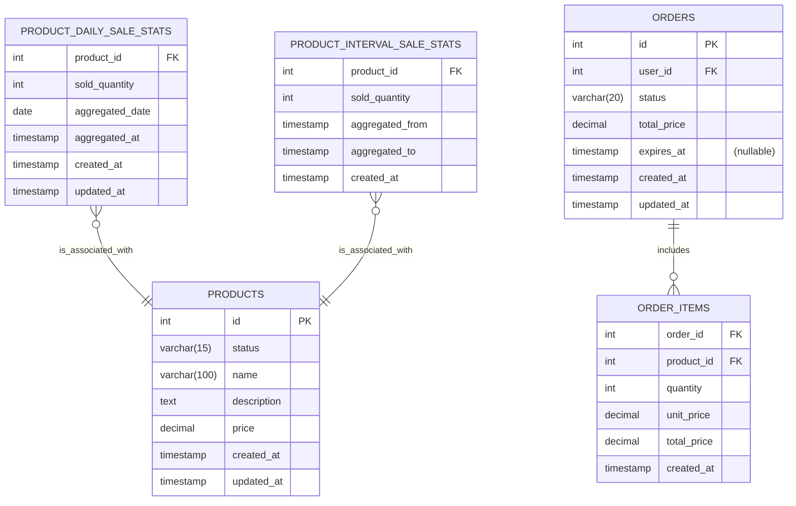

# 상위 상품 통계/조회

## 1. 시퀀스 다이어그램

### 1.1 통계 데이터 생성

- 인기 상품 의미 
  - 최근 3일간 가장 많이 팔린 상위 5개 상품 정보를 제공합니다.
    - 최근 3일은 조회일 기준 2일 전부터 오늘까지의 기간을 의미합니다.
      - ex) 오늘이 4월 3일이라면, 4월 1일부터 현재(마지막 배치 적용 시각)까지의 기간을 의미합니다.
    - 당일 급격하게 판매가 증가한 상품을 반영하기 위해, 최근 3일의 범위에 당일을 포함했습니다.
  - 주문 처리가 완료된 상태(`COMPLTED`)의 주문만 판매된 것으로 취급합니다.
- 10분 마다의 배치 
   - 이전 배치가 실행되지 않았을 것을 대비해, 10분 마다의 통계 데이터도 저장하도록 했습니다.
   - 현재 시각 기준 (실행 되지 않은 배치 포함) 10분 간의 통계 데이터를 산출하는 배치를 모두 실행하며, 일간 통계 데이터에 갱신합니다.
- 조회시 일간 통계를 기준으로 상위 판매 상품을 반환합니다.

### 1.2 상위 상품 조회

## 2. ERD

- PRODUCT_INTERVAL_SALE_STATS
  - 10분 간격으로 집계된 상품 판매 통계입니다.
- PRODUCT_DAILY_SALE_STATS
  - AGGREGATED_DATE와 PRODUCT_ID 조합으로 유니크한 키를 생성합니다.
- 집계 대상 
  - ORDERS.STATUS = `COMPLETED`이며, updated_at 시각이 집계 시간 내에 있는 주문입니다.
    - PRODUCT_MINUTES_SALE_STATS.aggregate_from ~ aggregate_to이 집계 시간
  - 해당 주문의 ORDER_ITEMS에 포함된 상품을 집계합니다.
