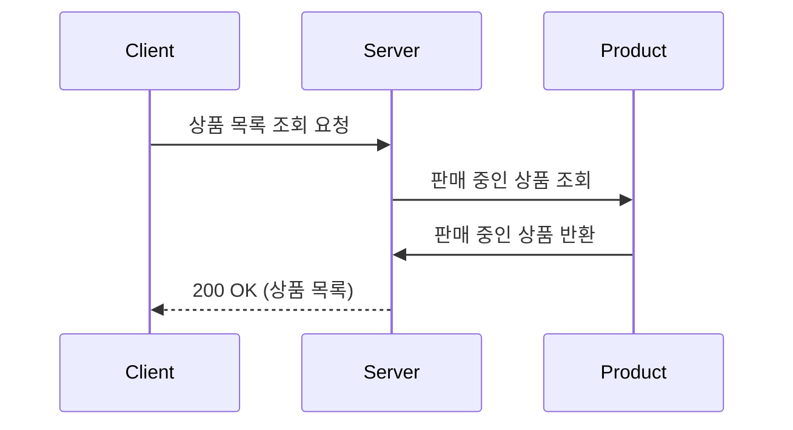
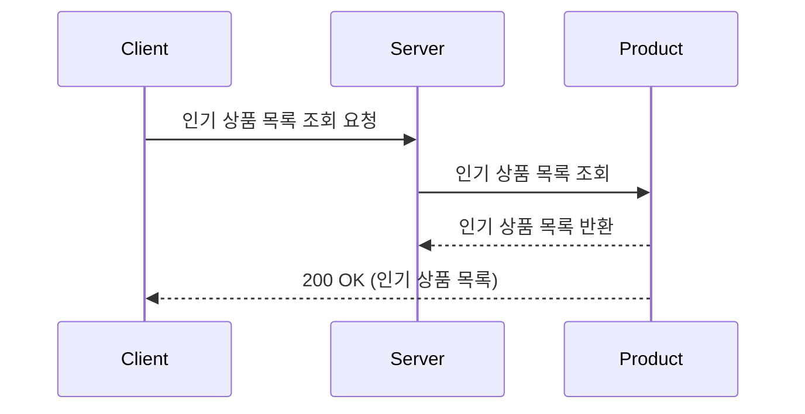
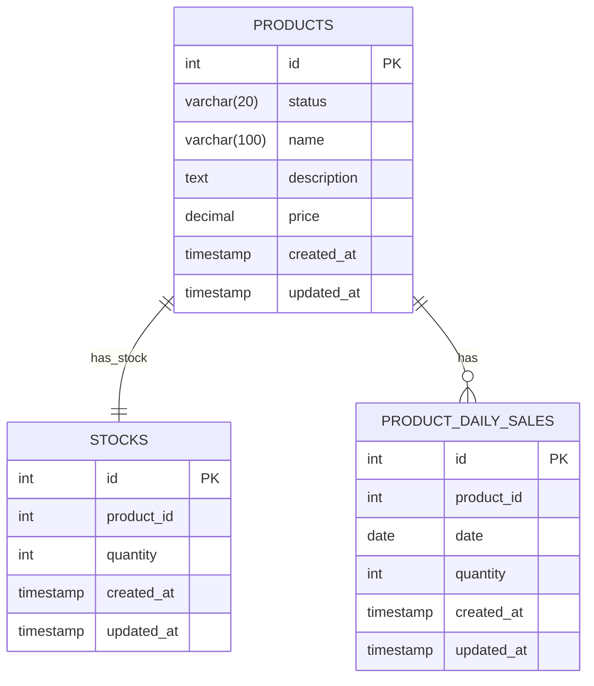

# 상품 조회

사용자는 판매 중인 상품 목록을 조회하거나, 인기 상품 목록을 조회할 수 있습니다.

## 1. 상품 목록 조회

### 1.1 기능 설명
사용자가 현재 판매 중인 상품 목록을 조회하는 기능입니다. 페이지네이션을 지원하여 대량의 상품을 효율적으로 조회할 수 있습니다.

#### 시퀀스 다이어그램

#### 주요 처리 로직
- **판매 중인 상품 조회**
    - 상태가 `ON_SALE`인 상품만 조회합니다.
    - 재고가 0인 상품도 조회됩니다. 
      - 판매가 중지된 것은 아니며, Server 재고가 추후 채워질 수 있기 때문입니다.
- **페이지네이션**
    - 페이지 번호와 페이지 크기를 지정하여 원하는 범위의 상품만 조회할 수 있습니다.
    - 기본적으로 생성일 기준 내림차순으로 정렬됩니다.

## 2. 인기 상품 조회

### 2.1 기능 설명
최근 판매량이 많은 인기 상품을 조회하는 기능입니다. 최근 3일간의 일간 판매 통계 데이터를 기반으로 상위 5개의 인기 상품 정보를 제공합니다.

#### 시퀀스 다이어그램

#### 주요 처리 로직
- **인기 상품 기준**
    - 최근 3일간(오늘 제외, 3일 전부터 1일 전까지) 판매량이 많은 상위 5개 상품을 인기 상품으로 정의합니다.
      - 예를 들어, 오늘이 4월 5일이라면, 4월 2일부터 4월 4일까지의 판매량을 기준으로 합니다.
    - 판매량은 일간 판매 통계 데이터를 기준으로 측정합니다.
- **캐싱 전략**
    - 인기 상품 ID 목록을 캐싱해 성능을 향상시킵니다.
    - 일별 판매 통계 집계 작업이 실행될 때마다 캐시가 갱신됩니다.

## 3. 데이터 모델 (ERD)

### 3.1 엔티티 설명

#### PRODUCTS
- 상품 정보를 저장하는 테이블
- `id`: 상품 고유 식별자
- `status`: 상품 상태 (ON_SALE: 판매중, INACTIVE: 판매중지)
- `name`: 상품 이름
- `description`: 상품 설명
- `price`: 상품 가격
- `created_at`: 생성 시각
- `updated_at`: 수정 시각

#### STOCKS
- 상품 재고 정보를 저장하는 테이블
- `id`: 재고 고유 식별자
- `product_id`: 상품 ID (외래 키)
- `quantity`: 재고 수량
- `created_at`: 재고 생성 시간
- `updated_at`: 재고 수정 시간

#### PRODUCT_DAILY_SALES
- 상품 일별 판매량을 저장하는 테이블
- `id`: 상품 일별 판매량 고유 식별자
- `product_id`: 상품 ID 
- `date`: 판매 날짜
- `quantity`: 판매 수량
- `created_at`: 생성 시각
- `updated_at`: 수정 시각

