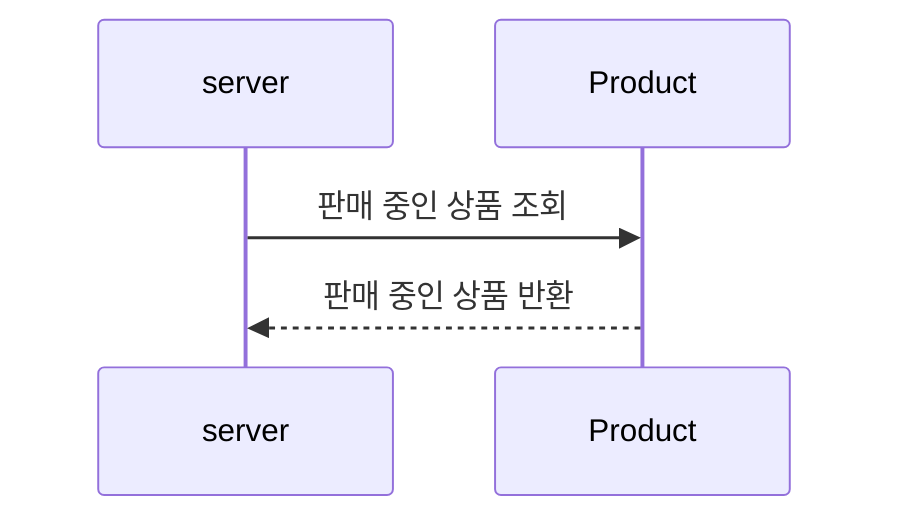
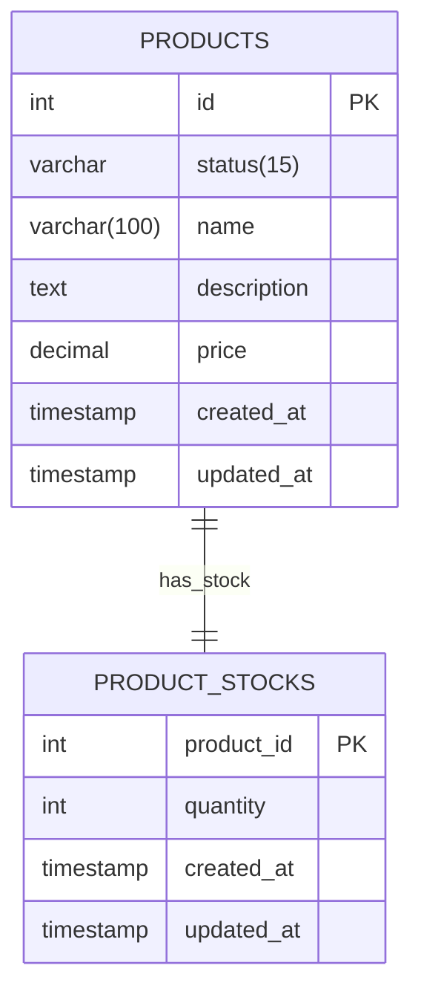

# 상품 조회
상품을 조회합니다.
- 상품 목록 조회
- 인기 상품 목록 조회

## 1. 상품 목록 조회

### 1.1. 상품 목록 조회 : 시퀀스 다이어그램

- 상품 중 '판매 중'인 상품만 조회합니다.

### 1.2 상품 목록 조회 : ERD

- 상태는 `INACTIVE`(판매중지), `ON_SALE`(판매중)으로 구분됩니다.
- 상품 조회시 조회 되는 '판매 중'인 상품이란, 상태가 `ON_SALE`인 상품을 의미합니다.
  - 재고가 0인 상품도 조회됩니다.
    - 판매가 중지된 것은 아니며, 재고가 채워질 수 있기 때문입니다.
